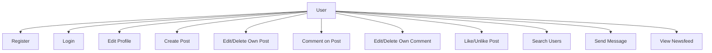
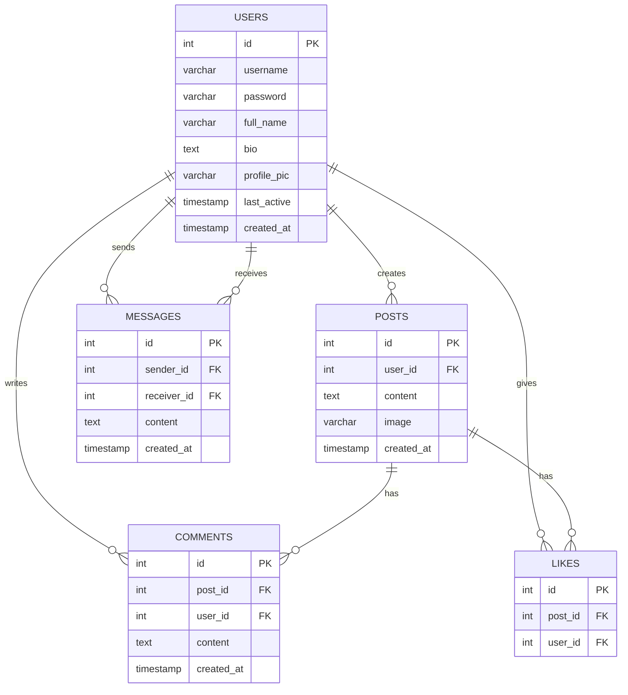

# CampusConnect Final Documentation

## 1. Cover Page

- Project Title: CampusConnect
- Course: Web Systems and Technologies
- Final Output: Mini Social Networking Web Application

## 2. Introduction

CampusConnect is a simplified social networking web application where users can create accounts, manage their profile, post updates, comment on posts, like content, search for other users, and send direct messages.

## 3. System Objectives

1. Build a dynamic full-stack PHP and MySQL application.
2. Apply MVC architecture in organizing the codebase.
3. Implement authentication, sessions, CRUD operations, and user interactions.
4. Build a responsive and user-friendly interface.
5. Apply security basics such as hashing, prepared statements, and output escaping.

## 4. System Features

- User registration, login, and logout
- Password hashing
- Profile editing with profile image and bio
- Post CRUD with optional image upload
- Comment CRUD
- Like/unlike reactions with counters
- Newsfeed ordered by latest posts
- Search users by name or username
- Direct messaging/chat
- Dark mode toggle

## 5. Use Case Diagram

## 6. Data Flow Diagram Summary

1. The browser sends a request.
2. `public/index.php` routes the request.
3. The controller validates and processes the request.
4. The model uses PDO prepared statements to access MySQL.
5. The controller passes data to the view.
6. The view renders the response.

## 7. ERD

## 8. Database Schema Description

- `users`: stores credentials and profile information
- `posts`: stores text/image posts
- `comments`: stores comments under posts
- `likes`: stores post reactions
- `messages`: stores direct messages between users

## 9. Screenshots of All Pages

Prepare screenshots for:

1. Login page
2. Register page
3. Newsfeed
4. Create/edit/delete post
5. Comments and likes
6. Profile page
7. Search page
8. Chat page

## 10. User Guide

1. Register an account.
2. Log in.
3. Create a post.
4. Add comments and likes.
5. Edit profile details.
6. Search users and send messages.

## 11. Team Members Contribution Report

- Member 1: Authentication and profile
- Member 2: Posts and comments
- Member 3: Likes, search, and chat
- Member 4: UI polish, testing, and documentation

Replace the placeholders with the actual team member names.
